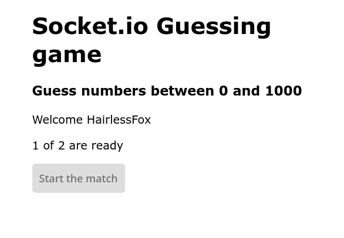
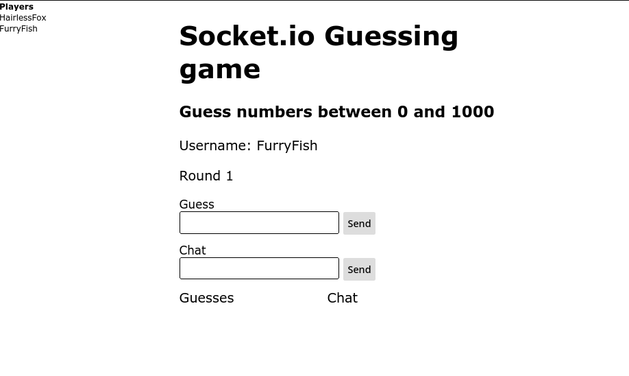
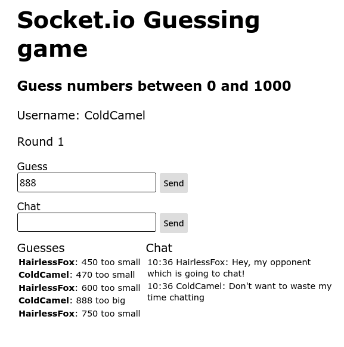
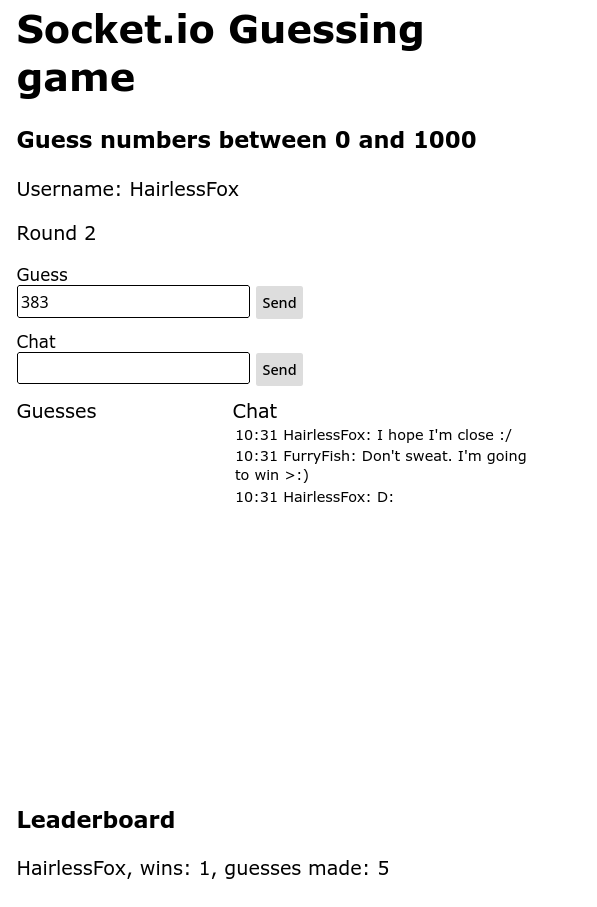

After cloning the repository you can get this project to launch using npm and node.js.

If you haven't installed them yet:
- [node.js](https://nodejs.org/en/)
- [npm](https://docs.npmjs.com/downloading-and-installing-node-js-and-npm)

Navigate to project folder and execute `npm install`
 
After installing necessary packages the application can be launched using `node app` command.

[Link to the project: Local host](http://localhost:3000/)

*Certain actions are logged to console which may help to understand how the application works.*

For testing the application successfully you need **two** instances running at the same time. Simply put open **two** tabs.

After both instances have successfully connected to server and confirmed they are **ready** you should see the actual game.

The goal is simple. Be the first to guess the randomly generated number. The application tells if your guess was too high or too low. You can also chat with your opponent with *wholesome* chat feature.

*Note: Wholesomeness depends on the players.*

After finishing the round, a new round starts shortly after automatically clearing the guesses.

And that's the application.

